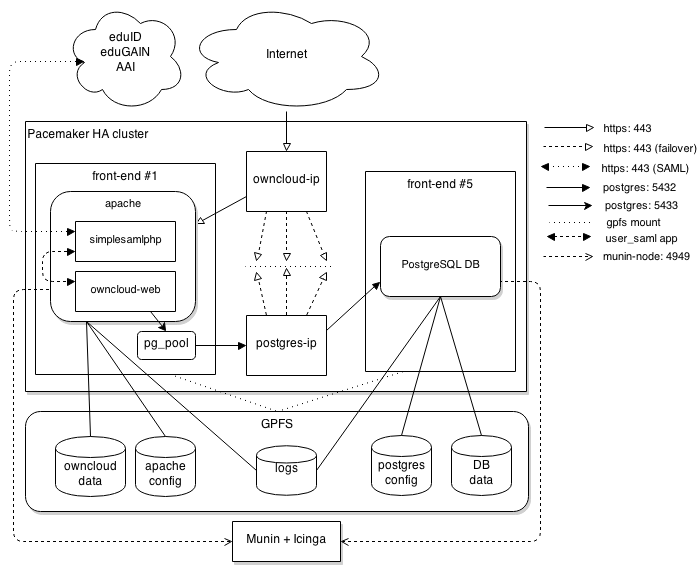

CESNET Architecture
===================

The following picture shows the current architecture of the
ownCloud service at CESNET.

Our ownCloud architecture is built on top of HA (High Availability) cluster
managed by Pacemaker_. Cluster consists of 5 equivalent nodes.
Pacemaker ensures that ownCloud and other relevant services are running
properly even if one or more front-end dies. All nodes are physical machines,
currently there is no virtualization at all.

Our system consists of the following components and services:

* Application Server
* Database Server
* PgPool proxy
* Pacemaker HA services
* Icinga & Munin monitoring servers
* eduID and eduGAIN authentication services
* GPFS storage

Specs
------

Hardware specifications for each front-end are as follows:

  * CPU: 2 x Intel(R) Xeon(R) CPU E5-2620 0 @ 2.00GHz (24 CPUs)
  * RAM: 96 GB (~ 40 GB free to use)
  * Network: 2 x 10 GE (bonded)

GPFS is being used as an underlying filesystem. OwnCloud utilizes a dedicated
40 TB volume which is mounted on all front-ends. The IBM DCS3700 disk array
is being used for data storage.

All front-end nodes are running Red Hat Enterprise Linux 6 with Red Hat subscription.

Application Server
------------------

OwnCloud application is handled by Apache_ 2.2 and PHP_ 5.4
(which has been installed from non-standard repository -- see this guide_).

Newer PHP version was used instead of default PHP 5.3 (on RHEL 6) version to allow
uploads of files larger than 2 GB. There were problems with this in 5.3.X series.
With PHP 5.4, we are able to do up to 16 GB uploads with no problems at all.

Apache is running as a standalone server without any HTTP(S) proxies in the way. It is
listening on port 80 and 443. HTTPS is being forced by redirection from 80 to 443.

Complete Apache + PHP configuration and website root is located on a shared GPFS volume,
which is mounted on all cluster nodes.

Apache is configured to use the default **prefork** MPM module for handling requests.
However, its configuration has been tweaked to match nodes specs and current load::
        <IfModule prefork.c>
        StartServers         500
        MinSpareServers       10
        MaxSpareServers       30
        ServerLimit         1800
        MaxClients          1600
        MaxRequestsPerChild 8000
        </IfModule>

Since we have quite a lot of RAM available, we increased the maximum number of workers
to 1600, so it uses up to 40 GB of RAM with some reserve (by our measurements, one Apache
worker proccess takes 22 MB in average).
In order to handle a peak load afer a server restart, when user's sync clients starts
reconnecting, the **StartServers** directive is set quite high too.

Apache is set up with `Zend OPcache`_ module for better PHP performance and `mod_xsendfile`_, which is being used for faster file downloads (also enables to pause/resume downloads).

Open Ports:

  * 80
  * 443

Database Server
---------------

PostgreSQL_ 8.4 is being used as a database server of choice. This is the highest version available
in standard RHEL 6 repositories. Database server runs as a single instance, always on a
different node than the Apache instance and without any replication yet (we are planning an upgrade to 9.4 and a streaming replication setup in the future).

OwnCloud PHP application doesn't access the PostgreSQL instance directly. It sends its queries
through `PgPool II`_, which acts as a connection cache (runs in the *Connection Pooling* mode).
This gives us some performance boost as it reduces database instance load and reuses existing connections. PgPool is run together with the Apache instance on the same node.

PostgreSQL engine parameters are mostly set according to the pgtune_ utility recommendations. It has allocated 40 GB of RAM, same as the Apache instance, and a maximum numer of connections is set to **51** (mostly based on this recommendations_).

Database server has its data and configuration stored on a shared GPFS volume just like the Apache server.

Open Ports:

  * 5432
  * 5433 (PgPool)

High Availability
-----------------

*Pacemaker resources setup, resource agents - @berosek*

User Authentication
-------------------

Authentication of users is based on SAML. It relies on the SimpleSAMLphp_ backend application.
SimpleSAMLphp backend is configured with eduID_ and eduGAIN_ metadata.
We are thus accepting users coming from these two identity federations.

When we were looking for a solution of user authentication, there were two available
user backends for ownCloud, which allowed federated identities to log in -- `user_saml`_ and `user_shibboleth`_. Both of them were quite outdated and not supported in ownCloud 6, however. We have picked the *user_saml* app and fixed an issues_ it had with OC 6.

Data Storage
------------

All the data is stored in GPFS (v 3.5.0.7), so all nodes in the cluster see the same data.
We have a filesystem dedicated for ownCloud, currently provisioned for 40TB. This filesystem
utilizes 4 RAID6 arrays from IBM DCS3700 disk array, which is connected through Fibre Channel
with all the frontend nodes. We use this filesystem for apache logs, Postgres database datafiles
and of course ownCloud data. Filesystem is configured with 2MB blocksize, which might seem too much,
but since our users create a lot of small files as well as files in order of gigabytes, this value has proven adequate.

Backups are realized using GPFS utility mmbackup. This utility scans the whole filesystem (using GPFS
inode scan interface) and backs up the changed or new files to Tivoli Storage Manager server. It uses
TSM's selective backup, so even if a file changes, it is backed up as a whole again. We retain history of 2 versions of the backed files for 60 days. We are using TSM 6.3.3 with IBM TS3500 tape library and seven IBM
3592 drives. These backups are run once a day from a cron job.

We also backup the Postgres database using pg_dump utility, once a day. Pg_dump generates the archive and
mmbackup finds this new file on the GPFS filesystem and backs it up with the rest of ownCloud files.

Monitoring
----------

Both Apache and PostgreSQL instances are constantly monitored by Icinga_ (fork of Nagios).
Following items are being checked:

  * SSL certificate validity
  * WebDAV file transfers
  * free space on OC GPFS volume
  * HTTP[S] protocol (Apache responding)
  * PING (machine with owncloud-ip responding)
  * PostgreSQL (Postgres is running and OC can connect to the database)

In addition to this, we use custom Munin_  plugin to collect usage statistics
and create graphs. We have currently graps for the following ownCloud statistics:

  * Number of user accounts
  * Number of files
  * Amount of user data stored

.. links
.. _Pacemaker: http://clusterlabs.org/quickstart-redhat.html
.. _Apache: https://httpd.apache.org/
.. _PHP: http://www.php.net/
.. _guide: http://developerblog.redhat.com/2013/08/01/php-5-4-on-rhel-6-using-rhscl/
.. _`Zend OPcache`: http://pecl.php.net/package/ZendOpcache
.. _`mod_xsendfile`: https://tn123.org/mod_xsendfile/
.. _PostgreSQL: http://www.postgresql.org/
.. _`PgPool II`: http://www.pgpool.net/mediawiki/index.php/Main_Page
.. _pgtune: http://pgtune.leopard.in.ua/
.. _recommendations: http://wiki.postgresql.org/wiki/Number_Of_Database_Connections#How_to_Find_the_Optimal_Database_Connection_Pool_Size
.. _SimpleSAMLphp: https://simplesamlphp.org/
.. _eduId: http://eduid.cz/
.. _eduGAIN: http://www.geant.net/service/eduGAIN/Pages/home.aspx
.. _`user_saml`: https://github.com/owncloud/apps/tree/master/user_saml
.. _`user_shibboleth`: https://github.com/AndreasErgenzinger/user_shibboleth
.. _Icinga: https://www.icinga.org/
.. _Munin: http://munin-monitoring.org/
.. _issues: https://github.com/owncloud/apps/pull/1681