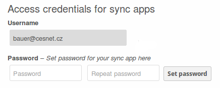

.. _cesnet-modifications:

CESNET Modifications to ownCloud
================================

We aren't running just a stock ownCloud source
with some 3rd party apps installed. During the
time we provided our sevice, we came across some
specific requirements, so we needed to develop
custom modifications. They are available at
our `cesnet/owncloud-apps`_ fork. This chapter
describes some of the modifications needed.

User Authentication and Management
----------------------------------

Most of our customizations went certainly to the
authentication and user management functions. In our setup,
the 'user_saml' app is responsible for this task. Fixing it
as discussed in the :ref:`samlfix` section enabled users
to log in and automatically create accounts.

But there were still problems that needed solving. Automatical
account creation had a side effect. Since users are entering their
login credentials at their organizations IdP, ownCloud side has no
way knowing the user's password. That way, the 'user_saml' app must
set a long enough random password for each new ownCloud user
automatically created.

Users don't need to know their ownCloud password as long as they don't
use some WebDAV client. But clients needs the ownCloud password and this
renders them completely unusable. To solve this, we have modded
the 'user_saml' application so it adds extra fields
to each user's 'Personal Settings' page, so that they can configure
their clients.

File Sharing
------------

Mail Notifications
------------------

Theming
-------

.. links:

.. _`cesnet/owncloud-apps`: https://github.com/CESNET/owncloud-apps
