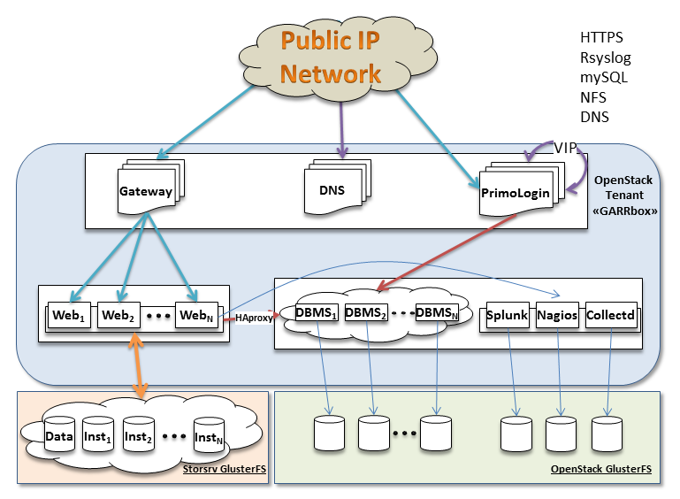
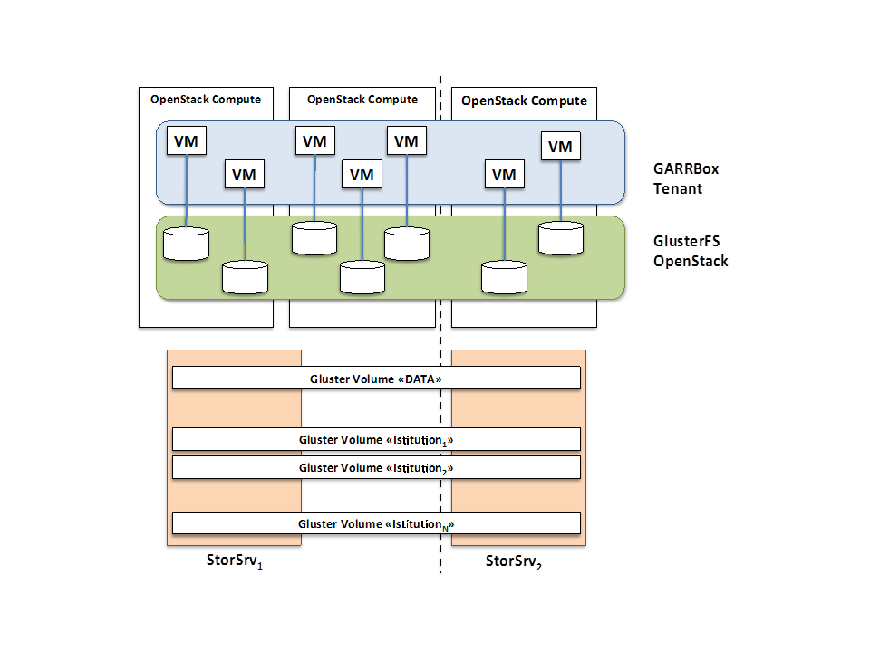

GARRbox Architecture
====================

Service description
-------------------

GARRbox is a personal cloud storage service designed for 
synchronizing and sharing users data in a secure and 
easy way. GARRbox is designed to support the needs of the 
Italian R&E Community. The service is the GARR 
response to a specific commitment from the Italian Ministry 
of Health for supporting the needs of the biomedical research 
community.

GARRbox takes inspiration from well-known cloud services like 
DropBox or Google Drive. 
It allows the synchronization of data among different devices 
like PC, smartphones and tablet, letting users share them with 
other users and collaboration groups in their home organizations.

GARRbox grants continuity and replica, adopting states of the 
art encryption techniques to protect data at rest. 

Users are not allowed to access the service directly. Their 
institutions subscribe the service and receive a number of users 
slots and a global amount of storage. By default every institution 
receives 100 user slots and 10 GB per user. 
The service supports autonomous administrative groups, so that 
the virtual managers at the institution can control user access 
and define individual quotas according the specific needs. 
When an institution needs more resources, they will be assigned 
with just a click.

GARRbox provides additional benefits to users
  * It is designed to keep data inside the national borders and 
    be run by national bodies, ensuring compliance with the laws 
    on privacy, copyright and resilience. 
  * It is a joint effort of the Italian Research and Education 
    community, supporting scale economies and equitable sharing 
    of benefits among members. 
  * It relies on an ad hoc infrastructure, but thanks to the 
    underlying cloud model principles it can scale in an elastic 
    way to include more resources according to the current workload. 
  * It is operated by GARR. This is a guarantee for  fairness, 
    openness and compliancy to the standards and the best practices 
    in both data preservation and sustainability of the service for 
    many years to come.

Architecture
------------

The following picture shows the current architecture diagram.

The current architecture has local HA (High Availability) enabled. 
All the VMs are running on physical hosts of the OpenStack 
deployment at GARR. 
The deployment is made of two sites at some kilometers from each other. 
The VMs storage (based on GlusterFS), the network (VLAN-based per
tenant networks) and the control of the compute nodes are unified, 
so that the two racks operate as a single pod. 

The users' data are hosted on a separate physical storage pool 
managed with GlusterFS.

The following picture shows a site view of the components layout.
 

All the VMs are under the aegis of a single tenant. 
VMs are grouped according their role in the architecture. 
For every role we defined a HA strategy and a virtual network. 
We also ensure that the VMs have been started on different compute 
nodes to minimize the impact in case of physical failure. 
In general, if one VM breaks, then there is at least another 
active VM that can provide the same are affected at the same time. 

We defined the following roles.
  * Access gateways and Name Servers
  * Web/Application servers
  * Database cluster
  * Monitoring services
  * PrimoLogin Authorization service
  * Storage pools

Common
------

All the virtual machines are running Ubuntu in a standard server 
installation. 
Most of them run 12.04, while Web/Application machines have been 
recently upgraded to 14.04.

Access Gateways
---------------

Incoming requests are handled by Nginx acting as a caching proxy. 
Nginx does load balancing and SSL termination. 
Doing SSL termination on the load balancer allows it to inject 
cookies into the HTTP traffic that enables it to provide "sticky 
sessions" (i.e. requests from a single client always go to the 
same web server).

A second Nginx VM is configured in Active/Passive mode with 
virtual IP exchange in case of failure of the primary gateway 
through heartbeat.

The gateways log files and resource consumption information is 
sent to the monitoring services.

Access gateways use the following flavors: 4 vCPU, 4 GB RAM, 
20 GB disk and are exposed to Internet. 

Open Ports:
  * 443

Name Servers
------------

Name resolution is provided by two Bind instances configured 
in Active/Passive mode.
The nodes are exposed to Internet and are built with the 
following flavors: 2 vCPU, 2 GB RAM, 20 GB disk.

Web/Application Servers
-----------------------

The web/application servers are handled by Apache and PHP5 FPM. 
Apache handles all incoming HTTP requests from the gateways 
using Event dispatcher, serves static files (css, js as well as 
the actual files stored in ownCloud) and passes all requests to 
ownCloud to the PHP5-FPM task.

PHP-FPM spawns a number of PHP worker processes on startup and 
manages them automatically (spawning more if the load rises and 
killing them again if load decreases). 
The goal is to have a PHP process ready whenever a request comes in. 
The process manager will always keep 8 PHP processes running 
and spawn up to 30 processes when under load.

Each web server mounts the ownCloud data directory as 
``/var/www/owncloud/data`` from the storage pool. 
Inside that global mount point, storing the ownCloud entry points 
for the actual users' locations, there is an additional mount 
point for every volume assigned to a GARRbox subscriber. 
The data of the GARR constituents are kept separate. 
Users store data on their institution dedicate volume and are 
allowed to share data only among other members of the same institution.

The ownCloud logfiles and resources consumption are sent to the 
monitoring services.

The web servers are 4vCPU, 16GB RAM, 20GB disk virtual machines. 
The amount of RAM is so high because ownCloud allows large files 
to be uploaded through the web UI. 
The maximal file size is 2GB, but during the upload, the file is 
in memory. 
Lower amounts of RAM could lead to situations where the memory on 
the server is being exhausted. 

For the first deployment we are using two active web server VMs 
and one back-up VM.

Open Ports (only to the internal network):
  * 22
  * 80

Database cluster
----------------

We decided to use Percona XtraDB Cluster instead of MySQL to 
store the database. 
The cluster is made of three nodes, two data nodes and the 
cluster coordinator, that ensure both HA and multi-master replication. 
The database is backed up periodically via a crontab entry. 

As ownCloud is read heavy (factor 1000:1) the web/application VMs 
connect to the least loaded cluster node passing through local 
HAproxy load balancers running on the ownCloud nodes. 
Therefore, from the client perspective the whole cluster is a 
single endpoint.

The cluster stores also the Authorization service database. 
Also the Authorization service VMs access the cluster passing 
through the load balancer. 

The VMs running the cluster are configured with 16 GB of RAM 
and 8 VCPUs and 20 GB storage.

Open Ports (only to the internal network):
  * 22
  * 3306

Monitoring services
-------------------

All the VMs the Web/Application, Database cluster, Application 
gateway and Authorization subsystems send syslog data to the 
monitoring system. 

In addition, the VMs are running probes to monitor the resources
consumption.

The syslog entries are collected and indexed in a Splunk node 
for single events insights and, more in general, fine grain 
analytics. 
The information from the probes is collected at Nagios and 
Collectd virtual machines for system level checks and alarms on 
the status of the service.

We are evaluating open source alternatives to Splunk like LogStash.

Authorization Service: PrimoLogin
---------------------------------

PrimoLogin (*first access* in Italian) is an auxiliary service 
developed by GARR both to bridge identities between AAI and local 
service credentials, needed by the synch clients on desktop and 
mobile, and to define and enforce authorization policies on 
institutions (groups of users), local virtual resources administrators 
and end users.

External users can login with AAI and are able to create a new 
account or to reset their password. 
According to the AAI affiliation, the access request is sent to 
the virtual resource administrators managing the pool of storage 
resources assigned to an institution. 
Through a joint usage of the features offered by ownCloud and 
Primologin, virtual resource administrators can grant access to 
their users, can block them and assign different personal quotas 
to users. 
Virtual resource administrators can also ask for larger collective 
storage pool or for additional slots when the allowed number of 
users is exceeded.

The server runs a Django application developed by GARR. 
GARR also developed a custom ownCloud login handler to enforce the 
policies that are defined by Primologin.

The VMs running PrimoLogin and its slave clone are equipped with 
8vCPU, 8GB RAM, and 20GB disk.
PrimoLogin is accessible from Internet.

Open ports:
  * 443

Storage pools
-------------

GARRbox uses two storage sources, both exposed as GlusterFS volumes. 
Virtual machine disks are built on top of a replicated gluster 
volume mounted on all the OpenStack compute nodes to enable 
live-migration. 
Persistent storage used by Database Cluster and Monitoring VMs is 
provided by OpenStack Cinder using a distributed replicated striped 
volume.

For OwnCloud data we use a separate pool of storage resources. 
Every GARRbox subscriber has a dedicated volume with a quota that 
is negotiated at activation time. Usually, institutions get 1TB 
volume as initial resource. 
OwnCloud nodes mount the volumes as separate endpoints. 
Simple HA is implemented at mount point side using simplified 
virtual IP mechanism provided by CTDB.

User storage is backed up on a regular base. 

Thoughts on High Availability at scale
--------------------------------------

The current setup aims at supporting a limited number of users 
with a minimal set of HA functionalities. 
The first phase of GARRbox aims at supporting biomedical research 
community, which typically has large sensible and valuable data 
like MRI images. 
Our current user community can involve up to about 5000 researchers.

Therefore, overall scalability is not the main goal in this moment. 
When we will become more confident with the service management, 
GARRbox will become available to larger communities like University
researchers and, in a long term perspective to students. 

We expect that the approach of having modular subsystems, most of 
which are stateless, with their own resiliency strategy allow us 
space for supporting quite easily larger user bases. 
Virtual machines failures are an infrequent event if compared to 
the underlying hardware failures. 
Live-migration, active/passive configurations and careful choice 
of VM initial locations (minimize the number of VMs on the same 
physical server) are a good starting point for getting both 
resiliency and balancing.

When larger user communities will access the service the 
architecture will have to satisfy both local scalability 
inside the datacenter, and global scalability among multiple 
sites at geographic scale. 
Storage clouds, because of the nature of the underlying virtual 
file-systems, are inherently constrained by the datacenters boundaries.

We believe that the only effective approach is the one adopted 
by big commercial players like Google or DropBox: have different 
datacenter with complete clones of the services, enact asynchronous
replication of persistent information (data and databases) and 
access and failover control by using IP, DNS and load balancing.

The cloned VMs could be left in suspended status to avoid the 
loss of resources, and activated in 

The adoption of proxies moving the frequently retrieved contents 
closer to the users is an additional optimization that will be 
taken into account.
